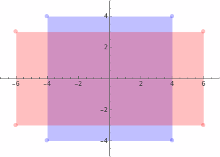
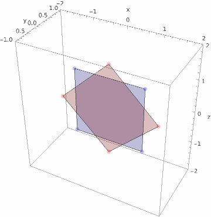
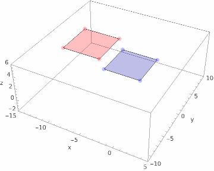
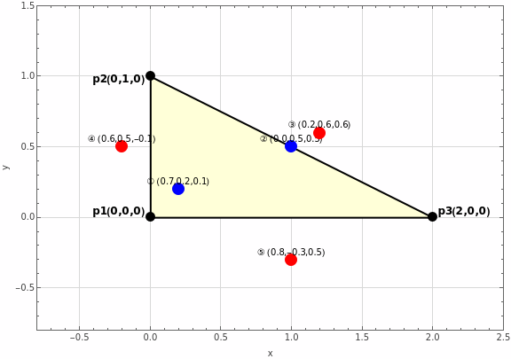

# Chapter3 Transformations

## Rotation 
- 벡터 $\mathbf{v}$를 $\mathbf{n}$(회전축에 대한 단위 벡터)을 기준으로 두 부분으로 분해  
  $\mathbf{v}_{\parallel }$ : $\mathbf{n}$에 평행  
  $\mathbf{v}_{\parallel } = (\mathbf{n}\cdot \mathbf{v})\mathbf{n}$  
  $\mathbf{v}_{\perp }$ : $\mathbf{n}$에 수직 ($\mathbf{v} - \mathbf{v}_{\parallel}$)  
  $\mathbf{v}_{\perp } = \mathbf{v} - (\mathbf{n}\cdot \mathbf{v})\mathbf{n}$  
  $\mathbf{v} = \mathbf{v}_{\parallel} + \mathbf{v}_{\perp}$ - eq.1  
   
  $\mathbf{R_n}(\mathbf{v})$을 $\mathbf{v}$와 $\mathbf{n}$에 대한 식으로 정리 하기 위해 벡터를 분해  
  $\mathbf{v}_{\parallel }$은 $\mathbf{n}$을 기준으로 회전해도 변하지 않으므로 $\mathbf{R_n}(\mathbf{v}_{\parallel}) = \mathbf{v}_{\parallel }$  
  eq.1을 대입  
  $\mathbf{R_n}(\mathbf{v}) = \mathbf{v}_{\parallel } + \mathbf{R_n}(\mathbf{v}_{\perp})$ ( $\because$ $\mathbf{R_n}$은 선형 함수 ) - eq.2  
   
  $\mathbf{R_n}(\mathbf{v}_{\perp})$은 $\mathbf{v}_{\perp}$와 $\mathbf{v}_{\perp}$에 직교하는 벡터($\mathbf{w}$)로 분해 가능  
  $\mathbf{R_n}(\mathbf{v}_{\perp}) = a\mathbf{v}_{\perp} + b\mathbf{w}$  
  양 변을 $\mathbf{v}_{\perp}$로 내적  
  $\mathbf{R_n}(\mathbf{v}_{\perp})\cdot \mathbf{v}_{\perp} = a(\mathbf{v}_{\perp}\cdot \mathbf{v}_{\perp}) + b(\mathbf{w}\cdot \mathbf{v}_{\perp})$  
  내적의 성질에 의해  
  $\mathbf{R_n}(\mathbf{v}_{\perp})\cdot \mathbf{v}_{\perp} = \left\| \mathbf{R_n}(\mathbf{v}_{\perp}) \right\|\left\| \mathbf{v}_{\perp} \right\|cos\theta$  
  $\mathbf{v}_{\perp }$의 길이를 $r$로 두면 ($\mathbf{R_n}(\mathbf{v}_{\perp})$도 회전한 벡터이기 때문에 길이는 $r$)  
  $r^2cos\theta = ar^2$ ($\mathbf{w}\cdot \mathbf{v}_{\perp}$는 직교하기 때문에 0)  
  $a = cos\theta$ 
  위와 동일한 방식으로 하면 $b = sin\theta$ ( $cos(90^{\circ}-\theta) = sin\theta$ )  
  $\mathbf{R_n}(\mathbf{v}_{\perp}) = cos\theta \mathbf{v}_{\perp} + sin\theta \mathbf{w}$ (2차원 회전 공식)  
   
  $\mathbf{w}$는 $\mathbf{v}_{\perp}$에 직교하는 벡터이므로 외적으로 표현 가능 $\mathbf{w}=\mathbf{n}\times \mathbf{v}_{\perp}$  
  또한 $\mathbf{v} = \mathbf{v}_{\parallel} + \mathbf{v}_{\perp}$이고 $\mathbf{n}\times \mathbf{v}_{\parallel}=0$ 이기 때문에 $\mathbf{w}=\mathbf{n}\times \mathbf{v}$  
  $\mathbf{R_n}(\mathbf{v}_{\perp}) = cos\theta (\mathbf{v} - (\mathbf{n}\cdot \mathbf{v})\mathbf{n}) + sin\theta (\mathbf{n}\times \mathbf{v})$  
  eq.2에 대입  
  $\mathbf{R_n}(\mathbf{v}) = (\mathbf{n}\cdot \mathbf{v})\mathbf{n} + cos\theta (\mathbf{v} - (\mathbf{n}\cdot \mathbf{v})\mathbf{n}) + sin\theta(\mathbf{n}\times \mathbf{v})$  
  정리하면  
  $\mathbf{R_n}(\mathbf{v}) = cos\theta \mathbf{v} + (1 - cos\theta)(\mathbf{n}\cdot \mathbf{v})\mathbf{n} + sin\theta(\mathbf{n}\times \mathbf{v})$ - **Rodrigues 회전 공식**  
- $\mathbf{R_n}(\mathbf{v})$는 선형 변환  
  내적과 외적은 분배법칙, 스칼라배 결합 법칙이 성립하기에 위 식은 선형 변환이다.  
- $\mathbf{R_n}(\mathbf{v})$가 선형 변환 이므로 표준 기저 벡터에 적용 후 행렬을 배치  
  $\mathbf{R_n}(\mathbf{v}) = x\mathbf{R_n}(\mathbf{i}) + y\mathbf{R_n}(\mathbf{j}) + z\mathbf{R_n}(\mathbf{k})$  
  $\mathbf{R_n}(\mathbf{i}) = cos\theta \mathbf{i} + (1-cos\theta)(\mathbf{n}\cdot \mathbf{i})\mathbf{n} + sin\theta(\mathbf{n}\times \mathbf{i})$  
  $\mathbf{i} = (1, 0, 0)$  
  1항 $cos\theta \mathbf{i} = (cos\theta, 0, 0)$  
  $\mathbf{n}\cdot \mathbf{i} = n_x$ 이므로  
  2항 $(1-cos\theta)(\mathbf{n}\cdot \mathbf{i})\mathbf{n} = ((1-cos\theta)(n_x)^2,\,(1-cos\theta)n_xn_y,\,(1-cos\theta)n_xn_z )$  
  3항 $sin\theta(\mathbf{n}\times \mathbf{i}) =(0,\, sin\theta n_z,\, -sin\theta n_y)$  
  $\mathbf{R_n}(\mathbf{i})=(cos\theta+(1-cos\theta)(n_x)^2,\,(1-cos\theta)n_xn_y+sin\theta n_z,\,(1-cos\theta)n_xn_z-sin\theta n_y)$  
  위와 동일한 방식으로  
  $\mathbf{R_n}(\mathbf{j})=((1-cos\theta)n_xn_y-sin\theta n_z,\,cos\theta+(1-cos\theta)(n_y)^2,\,(1-cos\theta)n_yn_z+sin\theta n_x)$  
  $\mathbf{R_n}(\mathbf{k})=((1-cos\theta)n_xn_z+sin\theta n_y,\,(1-cos\theta)n_yn_z-sin\theta n_x,\,cos\theta+(1-cos\theta)(n_z)^2)$  
  
  $\mathbf{R_n}=\begin{bmatrix} cos\theta+(1-cos\theta)(n_x)^2 & (1-cos\theta)n_xn_y+sin\theta n_z & (1-cos\theta)n_xn_z-sin\theta n_y\\ (1-cos\theta)n_xn_y-sin\theta n_z & cos\theta+(1-cos\theta)(n_y)^2 & (1-cos\theta)n_yn_z+sin\theta n_x\\(1-cos\theta)n_xn_z+sin\theta n_y & (1-cos\theta)n_yn_z-sin\theta n_x & cos\theta+(1-cos\theta)(n_z)^2\end{bmatrix}$  
  (회전 행렬)  
  각 행 벡터는 표준 기저에 대한 회전 변환이므로 길이는 1이고 서로 직교한다.  
  직교 행렬은 역행렬과 전치행렬이 동일하다  
  $\mathbf{R_n}^{-1} = \mathbf{R_n}^T$  
- 각 축을 중심으로 하는 회전 행렬  
  - $\mathbf{n} = (1, 0, 0)$ (x축)  
    $\mathbf{R}_x=\begin{bmatrix} 1 & 0 & 0 \\ 0 & cos\theta & sin\theta \\ 0 & -sin\theta & cos\theta\end{bmatrix}$  
  - $\mathbf{n}=(0,1,0)$ (y축)  
    $\mathbf{R}_y=\begin{bmatrix} cos\theta & 0 & -sin\theta \\ 0 & 1 & 0 \\ sin\theta & 0 & cos\theta\end{bmatrix}$  
  - $\mathbf{n}=(0,0,1)$ (z축)  
    $\mathbf{R}_z=\begin{bmatrix} cos\theta & sin\theta & 0 \\ -sin\theta & cos\theta & 0 \\ 0 & 0 & 1\end{bmatrix}$  
## Exercises

1. 선형 변환이 아니다. $(x - 3)$에서 상수항 때문에 $τ(k\mathbf{v}) = kτ(\mathbf{v})$가 성립되지 않음  
2. 선형 변환이다.  
   $\begin{bmatrix}3 & 0 & 4 \\2 & 0 & -1 \\1 & 1 & 1 \\\end{bmatrix}$  
3. $τ (1, 1, 1) = τ (1, 0, 0) + τ (0, 1, 0) + τ (0, 0, 1) = (9, 0, 7)$  
4. $\begin{bmatrix}2 & 0 & 0 \\0 & -3 & 0 \\0 & 0 & 1 \\\end{bmatrix}$  
5. 먼저 축을 정규화 $\hat{\mathbf{n}} = (\frac1{\sqrt3}, \frac1{\sqrt3}, \frac1{\sqrt3})$  
   축을 회전 행렬에 대입 ($\theta = 30^{\circ}$)  
   $\mathbf{R_n}=\begin{bmatrix} \frac{\sqrt3}2+(1-\frac{\sqrt3}2)(\frac1{\sqrt3})^2 & (1-\frac{\sqrt3}2)(\frac1{\sqrt3})^2+\frac12 \frac1{\sqrt3} & (1-\frac{\sqrt3}2)(\frac1{\sqrt3})^2-\frac12 \frac1{\sqrt3}\\ (1-\frac{\sqrt3}2)(\frac1{\sqrt3})^2-\frac12 \frac1{\sqrt3} & \frac{\sqrt3}2+(1-\frac{\sqrt3}2)(\frac1{\sqrt3})^2 & (1-\frac{\sqrt3}2)(\frac1{\sqrt3})^2+\frac12 \frac1{\sqrt3}\\(1-\frac{\sqrt3}2)(\frac1{\sqrt3})^2+\frac12 \frac1{\sqrt3} & (1-\frac{\sqrt3}2)(\frac1{\sqrt3})^2-\frac12 \frac1{\sqrt3} & \frac{\sqrt3}2+(1-\frac{\sqrt3}2)(\frac1{\sqrt3})^2\end{bmatrix}$  
   각 항을 정리  
   $\mathbf{R_n}=\begin{bmatrix} \frac{1+\sqrt3}3 & \frac13 & \frac{1-\sqrt3}3\\ \frac{1-\sqrt3}3 & \frac{1+\sqrt3}3 & \frac13\\\frac13 & \frac{1-\sqrt3}3 & \frac{1+\sqrt3}3\end{bmatrix}$  
6. $\begin{bmatrix}1 & 0 & 0 & 0\\0 & 1 & 0 & 0\\0 & 0 & 1 & 0\\4 & 0 & -9 & 1 \end{bmatrix}$  
7. $\begin{bmatrix}2 & 0 & 0 & 0\\0 & -3 & 0 & 0\\0 & 0 & 1 & 0\\4 & 0 & -9 & 1 \end{bmatrix}$  
8. $\begin{bmatrix}\frac{\sqrt2}2 & 0 & -\frac{\sqrt2}2 & 0\\0 & 1 & 0 & 0\\\frac{\sqrt2}2 & 0 & \frac{\sqrt2}2 & 0\\-2 & 5 & 1 & 1 \end{bmatrix}$  
9.    
     
10.   
      
11.   
      
12. 내적과 외적은 분배 법칙이 적용되므로 $\mathbf{R_n}(\mathbf{v}+\mathbf{u})=\mathbf{R_n}(\mathbf{v})+\mathbf{R_n}(\mathbf{u})$ 성립  
    마찬가지로 스칼라배 결합 법칙이 적용되기 때문에 $\mathbf{R_n}(k\mathbf{v}) =k\mathbf{R_n}(\mathbf{v})$도 성립  
    표준 행렬 표현은 위에서 정리함  
13.   
    $\mathbf{R_n}=\begin{bmatrix} cos\theta+(1-cos\theta)(n_x)^2 & (1-cos\theta)n_xn_y+sin\theta n_z & (1-cos\theta)n_xn_z-sin\theta n_y\\ (1-cos\theta)n_xn_y-sin\theta n_z & cos\theta+(1-cos\theta)(n_y)^2 & (1-cos\theta)n_yn_z+sin\theta n_x\\(1-cos\theta)n_xn_z+sin\theta n_y & (1-cos\theta)n_yn_z-sin\theta n_x & cos\theta+(1-cos\theta)(n_z)^2\end{bmatrix}$  
    $cos\theta = c,\; sin\theta = s,\; 1-cos\theta = a,\; n_x=x,\; n_y=y,\; n_z=z$ 라고하자  
    $r_1$이 $\mathbf{R_n}$의 첫번째 행이라고 하면  
    $\left\|r_1\right\|^2 = c^2 + 2acx^2 + a^2x^{4} + a^2x^2y^2 + 2asxyz + s^2z^2+ a^2x^2z^2 - 2asxyz + s^2y^2\\[8pt]$  
    $2asxyz$는 사라지고 $a^2x^2$으로 식을 정리하면  
    $\left\|r_1\right\|^2 = c^2 + 2acx^2 + a^2x^2(x^2+y^2+z^2) + s^2z^2 + s^2y^2\\[8pt]$  
    $x^2+y^2+z^2 = 1$이므로($\mathbf{n}$은 정규화된 벡터)  
    $\left\|r_1\right\|^2 = c^2 + 2acx^2 + a^2x^2+ s^2(y^2 + z^2)\\[8pt]$  
    $y^2 + z^2 = 1 - x^2$이므로  
    $\left\|r_1\right\|^2 = c^2 + 2acx^2 + a^2x^2+ s^2(1 - x^2)\\[8pt]$  
    $x^2$으로 묶어서 식을 정리하면  
    $\left\|r_1\right\|^2 = c^2 + s^2 + x^2(2ac + a^2 - s^2)\\[8pt]$  
    $a=1-c$를 대입  
    $\left\|r_1\right\|^2 = c^2 + s^2 + x^2(2c - 2c^2 + 1 - 2c + c^2 - s^2)\\[8pt]$ 
    식을 정리하면  
    $\left\|r_1\right\|^2 = c^2 + s^2 + x^2(1 - c^2 - s^2)\\[8pt]$  
    $cos^2\theta + sin^2\theta = 1$이므로  
    $\begin{align}\left\|r_1\right\|^2 &= 1 + x^2(1-1)\\&=1 \end{align}$
    $r_2,\; r_3\\[10pt]$도 위와 같이 정리됨. -> 모든 행벡터의 길이는 1  
    $\begin{align}r_1\cdot r_2 =\,& (c+ax^2)(axy-sz) + (axy+sz)(c+ay^2) + (axz-sy)(ayz+sx)\\ =\,& acxy-csz+a^2x^3y-asx^2z + acxy+ a^2xy^3 + csz + asy^2z + a^2xyz^2+asx^2z \\& - asy^2z-s^2xy \end{align}$  
    $csz,\; asx^2z,\; asy^2z$는 소거 $a^2xy$로 묶어서 식을 정리  
    $\begin{align}r_1\cdot r_2 =\,& 2acxy-s^2xy + a^2xy(x^2+y^2+z^2) \\ =\,&xy(2ac + a^2 - s^2) \end{align}$  
    [참조1](#ref1)에서 $2ac + a^2 - s^2 = 0$임을 확인했으므로  
    $r_1\cdot r_2 = 0$  
    다른 벡터들도 위와 같이 정리됨. -> 모든 행벡터는 서로 직교함  
    그러므로 $\mathbf{R_n}$은 정규직교행렬이다.  
14. ($\Rightarrow$) 직교행렬 $\mathbf{M}$의 행벡터를 $\mathbf{M}=[\mathbf{v}_1,\mathbf{v}_2\cdots \mathbf{v}_n]$ 라고 두자.  
    직교행렬의 정의에 의해 $\mathbf{M}$의 행벡터들은 서로 정규직교이다.(orthonormal)  
    $\mathbf{v}_i\cdot \mathbf{v}_j\left\{\begin{matrix} 1&(i=j)  \\ 0&(i\neq j)  \\\end{matrix}\right.$  
    $\mathbf{M}\mathbf{M}^T$의 $(i, j)$의 성분은 $\mathbf{v}_i\cdot \mathbf{v}_j$이다.  
    따라서 $\mathbf{M}\mathbf{M}^T = I$이고 $\mathbf{M}^T = \mathbf{M}^{-1}$  
    ($\Leftarrow$) $\mathbf{M}^T = \mathbf{M}^{-1}$ 이라고 하자.  
    양변에 $\mathbf{M}$을 곱하면 $\mathbf{M}\mathbf{M}^T = I$  
    행렬 $\mathbf{M}$의 행벡터들을 $\mathbf{M}=[\mathbf{v}_1,\mathbf{v}_2\cdots \mathbf{v}_n]$ 라고 두면  
    $\mathbf{M}\mathbf{M}^T$의 성분들은$\mathbf{v}_i\cdot \mathbf{v}_j$이고, $\mathbf{M}^T\mathbf{M}$은 단위 행렬이기 때문에  
    $\mathbf{v}_i\cdot \mathbf{v}_j\left\{\begin{matrix} 1&(i=j)  \\ 0&(i\neq j)  \\\end{matrix}\right.$  
    따라서 행렬 $\mathbf{M}$의 행벡터들이 정규직교이기 때문에 $\mathbf{M}$은 직교행렬이다.  
15. $\begin{bmatrix} x+b_x & y+b_y & z+b_z & 1\end{bmatrix}$, $\begin{bmatrix} x & y & z & 0\end{bmatrix}$  
    벡터는 시작점과 끝점을 기준으로 크기 및 방향이 결정되는데 평행 이동을 해도 벡터의 크기, 방향은 변화하지 않으므로 평행 이동에 의미가 없다.  
16.   
    $\mathbf{S} =\begin{bmatrix}s_x & 0 & 0 \\0 & s_y & 0 \\0 & 0 & s_z \\\end{bmatrix}$, $\mathbf{S}^{-1} =\begin{bmatrix}1/s_x & 0 & 0 \\0 & 1/s_y & 0 \\0 & 0 & 1/s_z \\\end{bmatrix}$  
    $\begin{align} \mathbf{S}\mathbf{S}^{-1} =& \begin{bmatrix} s_x \times 1/s_x & 0 & 0 \\0 & s_y \times 1/s_y & 0 \\0 & 0 & s_z \times 1/s_z \\\end{bmatrix} \\=& \begin{bmatrix} 1 & 0 & 0 \\0 & 1 & 0 \\0 & 0 & 1 \\\end{bmatrix} \end{align}$  
    $\mathbf{S}^{-1}\mathbf{S}$도 동일  
    $\mathbf{T} = \begin{bmatrix}1 & 0 & 0 & 0\\ 0 & 1 & 0 & 0\\ 0 & 0 & 1 & 0\\ b_x & b_y & b_z & 1 \end{bmatrix}$, $\mathbf{T}^{-1} = \begin{bmatrix}1 & 0 & 0 & 0\\ 0 & 1 & 0 & 0\\ 0 & 0 & 1 & 0\\ -b_x & -b_y & -b_z & 1 \end{bmatrix}$  
    $\begin{align}\mathbf{T}\mathbf{T}^{-1} =& \begin{bmatrix}1+b_x-b_x & 0 & 0 & 0\\ 0 & 1+b_y-b_y & 0 & 0\\ 0 & 0 & 1+b_z-b_z & 0\\ 0 & 0 & 0 & 1 \end{bmatrix} \\ =& \begin{bmatrix}1 & 0 & 0 & 0\\ 0 & 1 & 0 & 0\\ 0 & 0 & 1 & 0\\ 0 & 0 & 0 & 1 \end{bmatrix} \end{align}$  
    $\mathbf{T}^{-1}\mathbf{T}$도 동일  
17.   
    $\mathbf{T}_{A\to B} =\begin{bmatrix}\frac1{\sqrt2} & \frac1{\sqrt2} & 0 & 0\\ -\frac1{\sqrt2} & \frac1{\sqrt2} & 0 & 0\\ 0 & 0 & 1 & 0\\ -6 & 2 & 0 & 1 \end{bmatrix}$ (z축을 중심으로 $45^{\circ}$회전 후 $(-6, 2, 0)$만큼 평행이동)  
    $\begin{align}\mathbf{p}_{B} =& \begin{bmatrix} 1 & -2 & 0 & 1\end{bmatrix} \begin{bmatrix}\frac1{\sqrt2} & \frac1{\sqrt2} & 0 & 0\\ -\frac1{\sqrt2} & \frac1{\sqrt2} & 0 & 0\\ 0 & 0 & 1 & 0\\ -6 & 2 & 0 & 1 \end{bmatrix} \;(\mathbf{p}_{B}는\; 점이므로 \; \mathbf{w} = 1) \\ =& \begin{bmatrix} \frac1{\sqrt2} + \frac2{\sqrt2} - 6 & \frac1{\sqrt2} - \frac2{\sqrt2} + 2 & 0 & 1 \end{bmatrix} \\ =& \begin{bmatrix} \frac3{\sqrt2} - 6 &- \frac1{\sqrt2} + 2 & 0 & 1 \end{bmatrix}\end{align}$  
    $\begin{align}\mathbf{q}_{B} =& \begin{bmatrix} 1 & 2 & 0 & 0\end{bmatrix} \begin{bmatrix}\frac1{\sqrt2} & \frac1{\sqrt2} & 0 & 0\\ -\frac1{\sqrt2} & \frac1{\sqrt2} & 0 & 0\\ 0 & 0 & 1 & 0\\ -6 & 2 & 0 & 1 \end{bmatrix} \;(\mathbf{q}_{B}는\; 힘벡터이므로\; \mathbf{w}=0) \\ =& \begin{bmatrix} \frac1{\sqrt2} - \frac2{\sqrt2} & \frac1{\sqrt2} + \frac2{\sqrt2} & 0 & 0 \end{bmatrix} \\ =& \begin{bmatrix} -\frac1{\sqrt2} & \frac3{\sqrt2}  & 0 & 0 \end{bmatrix}\end{align}$  
18. $\mathbf{p}_2,\, _{\cdots}\,, \mathbf{p}_n$을 $\mathbf{p}_1+(\mathbf{p}_k−\mathbf{p}_1)$ 형태로 변경하면  
    $\begin{align}\mathbf{p} &= (a_1 + \, _{\cdots} + a_n) \mathbf{p}_1 + a_2 (\mathbf{p}_2 - \mathbf{p}_1 ) + \, _{\cdots} + a_n (\mathbf{p}_n - \mathbf{p}_1 ) \\ &= \mathbf{p}_1 + a_2 (\mathbf{p}_2 - \mathbf{p}_1 ) + \, _{\cdots} + a_n (\mathbf{p}_n - \mathbf{p}_1 ) \end{align}$  
    아핀 공간에서 점 - 점 = 벡터이므로 $a_2 (\mathbf{p}_2 - \mathbf{p}_1 ) + \, _{\cdots} + a_n (\mathbf{p}_n - \mathbf{p}_1 )$의 항들은 스칼라 x 벡터 값으로 변한되고 벡터 연산을 통해 특정 벡터($\mathbf{v}$)로 치환 가능함.  
    따라서 $\mathbf{p} = \mathbf{p}_1 + \mathbf{v}$로 하나의 점과 하나의 벡터의 합으로 표현 가능하다.  
19. $(a)$ 점은 어떤 특별한 성질을 가지는가?  
    -> 삼각형 내부에 존재한다. 모든 계수가 양수이다.  
    점 $\mathbf{p}_2$와 점 $(1,0,0)$을 $\mathbf{p}_1, \mathbf{p}_2, \mathbf{p}_3$에 대한 바리센트릭 좌표로 나타내면 각각 무엇인가?  
    -> $(0, 1, 0)$, $(0.5, 0, 0.5)$  
    바리센트릭 좌표들 중 하나가 음수라면, 점 $\mathbf{p}$는 삼각형에 대해 어디에 위치하게 될지 추측해 보아라.  
    -> 삼각형 외부에 위치한다.  
        
20. 아핀 변환을 $\alpha(\mathbf{p}) = \mathbf{A}p + \mathbf{b}$꼴로 표현 하면 ($\mathbf{A}$는 선형변환 행렬 $\mathbf{b}$는 평행이동 벡터)  
    좌변은  
    $\alpha(a_1\mathbf{p}_1+\cdots+a_n\mathbf{p}_n) = A(a_1\mathbf{p}_1+\cdots+a_n\mathbf{p}_n)+b$ 이고,  
    우변은  
    $\begin{align}a_1\alpha(\mathbf{p}_1)+\cdots+a_n\alpha(\mathbf{p}_n) &= a_1(A\mathbf{p}_1+b)+\cdots+a_n(A\mathbf{p}_n+b)\\ &=A(a_1\mathbf{p}_1+\cdots+a_n\mathbf{p}_n) + (a_1+\cdots+a_n)b \\ &= A(a_1\mathbf{p}_1+\cdots+a_n\mathbf{p}_n)+b \end{align}$   
    이므로 아핀 결합을 보존한다.  
21. $A$좌표계의 점$\mathbf{P}$를 $B$좌표계에 대한 식으로 다음과 같이 표현할 수 있다.   
    $\mathbf{P}_B = x\mathbf{u}_B + y\mathbf{v}_B + z\mathbf{w}_B + \mathbf{Q}_B$  
    이때, $\mathbf{Q}_B$ 는 $A$ 좌표계의 원점에 대한 $B$ 좌표이고, $(0.5, 0.5, 0)$이다. (정사각형의 중심점)  
    $\mathbf{u}_B$는 $A$ 좌표계의 $x$축 단위 벡터에 대한 $B$ 좌표이고,  
    $\begin{align}\mathbf{u}_B &= (1, 0.5, 0) - (0.5, 0.5, 0)\\&= (0.5, 0, 0)\end{align}$  
    $\mathbf{v}_B$는 A 좌표계의 $y$축 단위 벡터에 대한 $B$ 좌표이고,  
    $\begin{align}\mathbf{v}_B &= (0.5, 0, 0) - (0.5, 0.5, 0)\\&= (0, -0.5, 0)\end{align}$  
    $\mathbf{w}_B$는 변화가 없으므로 $(0, 0, 1)$  
    따라서 이를 행렬로 표현하면  
    $\begin{bmatrix}0.5 & 0 & 0 & 0\\ 0 & -0.5 & 0 & 0\\ 0 & 0 & 1 & 0\\ 0.5 & 0.5 & 0 & 1 \end{bmatrix}$  
22.   
    $\mathbf{S}=\begin{bmatrix}s_x & 0 & 0\\ 0 & s_y & 0\\ 0 & 0 & s_z\end{bmatrix}$  
    $\det \mathbf{S} = s_x(s_ys_z - 0) = s_xs_ys_z$  
    스케일링 변환은 x, y, z축의 방향의 길이를 각각 $s_x,\, s_y,\, s_z$배 하므로,  
    부피는 $\left|s_xs_ys_z\right|$배 증가한다. 여기서 행렬식의 부호는 축의 반전을 의미한다.  
23. 변환 행렬은 다음과 같다. $\begin{bmatrix} 3 & 1 \\ 1 & 2\end{bmatrix}$  
    행렬식은 $3 \times 2 - 1 \times 1 = 5$  
    $\tau(\mathbf{i}) = 3x+ y$ $\tau(\mathbf{j}) = x + 2y$ 두 백터가 이루는 평행사변형의 넓이는 곧 외적값의 절대값이다.  
    $\left\| \tau(\mathbf{i}) \times \tau(\mathbf{j}) \right\| = \left| 3 \times 2 - 1 \times 1 \right| = 5$  
    따라서 두 값은 같다.    
24.    
    $\mathbf{R_n}=\begin{bmatrix} cos\theta+(1-cos\theta)(n_x)^2 & (1-cos\theta)n_xn_y+sin\theta n_z & (1-cos\theta)n_xn_z-sin\theta n_y\\ (1-cos\theta)n_xn_y-sin\theta n_z & cos\theta+(1-cos\theta)(n_y)^2 & (1-cos\theta)n_yn_z+sin\theta n_x\\(1-cos\theta)n_xn_z+sin\theta n_y & (1-cos\theta)n_yn_z-sin\theta n_x & cos\theta+(1-cos\theta)(n_z)^2\end{bmatrix}$  
    $cos\theta = c,\; sin\theta = s,\; 1-cos\theta = a,\; n_x=x,\; n_y=y,\; n_z=z$ 라고하자  
    $\begin{align}\det \mathbf{R_n} =&\, (c + ax^2)((c+ay^2)(c+az^2) - (ayz + sx)(ayz - sx)) \\ &- (axy +sz)((c + az^2)(axy - sz) - (ayz +sx)(axz + sy)) \\ &+ (axz - sy)((axy -sz)(ayz - sx) - (c + ay^2)(axz + sy)) \end{align}$  
    첫번째 항을 전개하면  
    $\begin{align}&(c + ax^2)((c + ay^2)(c + az^2) - (ayz + sx)(ayz - sx))\\=& (c+ax^2)(c^2 + acz^2 + acy^2 + a^2y^2z^2 − (a^2y^2z^2 − s^2x^2)) \\=& (c+ax^2)(c^2 + ac(y^2 + z^2) + s^2x^2) \\=& (c+ax^2)(c^2 + c(1 - c)(1 - x^2) + s^2x^2) \\=& (c+ax^2)(c^2 + (c - c^2)(1 - x^2) + s^2x^2)\\=& (c+ax^2)(c^2 + c - cx^2 - c^2 + c^2x^2 + s^2x^2) \\=& (c+ax^2)(c - cx^2 + x^2(s^2 + c^2)) \\=& (c+ax^2)(c - cx^2 + x^2) \\=& (c+ax^2)(c + x^2(1 - c)) \\=& (c+ax^2)(c+ax^2) = (c+ax^2)^2   \end{align}$  
    두번째 항을 전개  
    $\begin{align}&-(axy + sz)((c + az^2)(axy - sz) - (ayz + sx)(axz + sy))\\=& -(axy+sz)(acxy - csz + a^2xyz^2 - asz^3 - (a^2xyz^2 + asy^2z + asx^2z + s^2xy)) \\=& -(axy + sz)(acxy − csz − asz^3 − asy^2z − asx^2z − s^2xy) \\=& -(axy + sz)(acxy - csz - asz(x^2 + y^2 + z^2) - s^2xy) \\=& -(axy + sz)(acxy - csz - asz - s^2xy) \\=& -(axy + sz)((1-c)cxy - csz - (1-c)sz - s^2xy) \\=& -(axy + sz)(cxy -c^2xy - csz - sz + csz - s^2xy) \\=& -(axy + sz)(cxy - sz - xy(s^2 + c^2)) \\=& -(axy + sz)(cxy - sz - xy) \\=& -(axy + sz)(-((1-c)xy + sz)) \\=& -(axy + sz)(-(axy + sz)) = (axy+sz)^2 \end{align}$  
    세번째 항을 전개  
    $\begin{align}&(axz - sy)((axy -sz)(ayz - sx) - (c + ay^2)(axz + sy))\\=&(axz-sy)(a^2xy2^z − asx^2y − asyz^2 + s^2xz - (acxz + csy + a^2xy^2z + asy^3))\\=&(axz-sy)(−asy(x^2 + y^2 + z^2) + s^2xz - acxz - csy)) \\=&(axz-sy)(−asy + s^2xz - acxz - csy)) \\=&(axz-sy)(−(1-c)sy + s^2xz - (1-c)cxz - csy)) \\=&(axz-sy)(-sy + csy + s^2xz - cxz + c^2xz - csy)) \\=&(axz-sy)(xz(s^2 + c^2) -cxz -sy) \\=&(axz-sy)(xz -cxz -sy) \\=&(axz-sy)(xz(1 - c) -sy)) \\=&(axz-sy)(axz - sy) = (axz-sy)^2  \end{align}$  
    따라서  
    $\begin{align}\det \mathbf{R_n} =& (c+ax^2)^2 + (axy+sz)^2 + (axz-sy)^2 \\=& c^2 + 2acx^2 + a^2x^4 + a^2x^2y^2 + 2asxyz + s^2z^2 + a^2x^2z^2 - 2asxyz + s^2y^2 \\=& c^2 + 2acx^2 + a^2x^2(x^2 + y^2 + z^2) + s^2(y^2 + z^2) \\=& c^2 + 2acx^2 + a^2x^2 + s^2(1 - x^2) \\=& c^2 + s^2 + 2acx^2 + a^2x^2 - s^2x^2 \\=& 1 + x^2(2ac + a^2 - s^2) \end{align}$  
    [참조1](#ref1)에서 $2ac + a^2 - s^2 = 0$임을 확인했으므로  
    $\det \mathbf{R_n} = 1$  
    $\mathbf{R_n}$은 회전 변환 이므로 변환에 의해 부피가 변하지 않음.  
    선형 변환 행렬의 행렬식은 부피의 크기를 나타내므로 값은 1이다.  
25. $\mathbf{R}_1과 \mathbf{R}_2$는 회전 행렬이므로 $\mathbf{R}_1\mathbf{R}_1^T = I$, $\mathbf{R}_2\mathbf{R}_2^T = I$  
    $\mathbf{R}_1\mathbf{R}_2 =\mathbf{R}$에서 좌측에 $\mathbf{R}_1^T$를 곱하면  
    $\begin{align}\mathbf{R}_1^T\mathbf{R}_1\mathbf{R}_2 =\mathbf{R}_1^T\mathbf{R} \\ \mathbf{R}_2 =\mathbf{R}_1^T\mathbf{R} \end{align}$   
    마찬가지로 좌측에 $\mathbf{R}_2^T$를 곱하면  
    $\begin{align}\mathbf{R}_2^T\mathbf{R}_2 =\mathbf{R}_2^T\mathbf{R}_1^T\mathbf{R} \\ I =\mathbf{R}_2^T\mathbf{R}_1^T\mathbf{R} \end{align}$  
    전치 행렬의 성질에 의해 $(\mathbf{R}_1\mathbf{R}_2)^T = \mathbf{R}_2^T\mathbf{R}_1^T$  
    따라서 $(\mathbf{R}_1\mathbf{R}_2)^T\mathbf{R} = I$, $\mathbf{R}^T\mathbf{R}=I$  
    $\mathbf{R}^T$는 $\mathbf{R}$의 역행렬이므로 $\mathbf{R}\mathbf{R}^T = \mathbf{R}^T\mathbf{R} = I$  
    행렬식의 성질에 의해  
    $\det \mathbf{R} = \det \mathbf{R}_1\det \mathbf{R}_2$  
    $\mathbf{R}_1과 \mathbf{R}_2$는 회전 행렬이므로 행렬식은 1  
    따라서 $\det \mathbf{R} = 1$  
26. 내적 보존  
    벡터 $\mathbf{x}$를 행렬로 표현하면 $\begin{bmatrix}x & y & z\end{bmatrix}$와 같을 때 $\mathbf{x} \cdot \mathbf{y}$는 행렬$\mathbf{x}$와 행렬$\mathbf{y}^T$의  행렬곱과 같다.  
    $(\mathbf{u}\mathbf{R})\cdot(\mathbf{v}\mathbf{R}) = \mathbf{u}\cdot \mathbf{v}$를 행렬곱으로 표현하면  
    $(\mathbf{u}\mathbf{R})(\mathbf{v}\mathbf{R})^T=\mathbf{u}\mathbf{v}^T$  
    전치 행렬의 성질에 의해  
    $\mathbf{u}\mathbf{R}\mathbf{R}^T\mathbf{v}^T=\mathbf{u}\mathbf{v}^T$  
    $\mathbf{R}\mathbf{R}^T = I$ 이므로  
    $\mathbf{u}\mathbf{v}^T =\mathbf{u}\mathbf{v}^T$  
    따라서
    $(\mathbf{u}\mathbf{R})\cdot(\mathbf{v}\mathbf{R}) = \mathbf{u}\cdot \mathbf{v}$는 회전 행렬에 대해 성립한다.
    길이 보존  
    벡터의 길이는 다음과 같이 표현 가능하다. $\left\| x \right\| = \sqrt{x \cdot x}$  
    따라서 $\left\| \mathbf{u}\mathbf{R} \right\| = \left\| \mathbf{u} \right\|$는 $\sqrt{\mathbf{u}\mathbf{R} \cdot \mathbf{u}\mathbf{R}} = \sqrt{\mathbf{u} \cdot \mathbf{u}}$ 로 표현 가능하고  
    앞서 내적 보존이 회전 행렬에 대해 성립함을 확인했으므로  
    $\left\| \mathbf{u}\mathbf{R} \right\| = \left\| \mathbf{u} \right\|$도 회전 행렬에 대해 성립한다.  
    각도 보존  
    $\theta(\mathbf{u}\mathbf{R}, \mathbf{v}\mathbf{R}) = \theta(\mathbf{u}, \mathbf{v})$를 식으로 전개하면  
    $cos^{-1} \frac{\mathbf{u}\mathbf{R}\cdot \mathbf{v}\mathbf{R}}{\left\| \mathbf{u}\mathbf{R} \right\| \left\| \mathbf{v}\mathbf{R} \right\|} = cos^{-1} \frac{\mathbf{u}\cdot \mathbf{v}}{\left\| \mathbf{u} \right\| \left\| \mathbf{v} \right\|}$  
    앞서 회전 행렬에 대해 내적과 길이가 보존됨을 확인했으므로  
    $\theta(\mathbf{u}\mathbf{R}, \mathbf{v}\mathbf{R}) = \theta(\mathbf{u}, \mathbf{v})$  는 회전 행렬에 대해 성립한다.  
    회전 변환은 벡터의 크기는 변하지 않고, 벡터의 방향만 변환 시킨다.  
    따라서 크기는 변화하지 않고,  
    같은 회전을 적용 시킨 두 벡터 사이의 내적과 각도도 변하지 않는다.  
27. 스케일링 행렬  
    $\mathbf{S} = \begin{bmatrix}1 & 0 & 0 \\ 0 & 1 & 0 \\ 0 & 0 & 2 \end{bmatrix}$  
    회전 행렬  
    벡터 $(0, 0, 1)$과 벡터 $(1, 1, 1)$의 회전축의 방향은 두 벡터의 외적의 방향과 같다.  
    $(0, 0, 1) \times (1, 1, 1) = (0 - 1, 1 - 0, 0 - 0) = (-1 , 1, 0)$  
    회전축 $\mathbf{n}$은 이를 정규화한 $(-\frac{1}{\sqrt{2}}, \frac{1}{\sqrt{2}}, 0)$  
    각도는 연습문제 26번의 식을 사용하면  
    $\theta = cos^{-1} \frac{(0, 0, 1)\cdot (1, 1, 1)}{\left\| (0, 0, 1) \right\| \left\| (1, 1, 1) \right\|} =cos^{-1} \frac{0 + 0 + 1}{1 \times \sqrt{3}} = cos^{-1} \frac{1}{\sqrt{3}}$  
    따라서 $cos\theta = \frac{1}{\sqrt{3}}$ $sin\theta = \sqrt{1 - cos^2\theta} = \sqrt{1 - \frac{1}{3}} = \sqrt{\frac{2}{3}}$  
    이를 회전 행렬에 대입  
    $\mathbf{R_n}=\begin{bmatrix} cos\theta+(1-cos\theta)(n_x)^2 & (1-cos\theta)n_xn_y+sin\theta n_z & (1-cos\theta)n_xn_z-sin\theta n_y\\ (1-cos\theta)n_xn_y-sin\theta n_z & cos\theta+(1-cos\theta)(n_y)^2 & (1-cos\theta)n_yn_z+sin\theta n_x\\(1-cos\theta)n_xn_z+sin\theta n_y & (1-cos\theta)n_yn_z-sin\theta n_x & cos\theta+(1-cos\theta)(n_z)^2\end{bmatrix}$  
    $\begin{align} \mathbf{R_n} &= \begin{bmatrix} \frac{1}{\sqrt{3}}+(1-\frac{1}{\sqrt{3}})(-\frac{1}{\sqrt{2}})^2 & (1-\frac{1}{\sqrt{3}})(-\frac{1}{\sqrt{2}}\cdot\frac{1}{\sqrt{2}}) + 0 & 0-\sqrt{\frac{2}{3}}\cdot\frac{1}{\sqrt{2}} \\ (1-\frac{1}{\sqrt{3}})(-\frac{1}{\sqrt{2}}\cdot\frac{1}{\sqrt{2}})- 0 & \frac{1}{\sqrt{3}}+(1-\frac{1}{\sqrt{3}})(\frac{1}{\sqrt{2}})^2 & 0+\sqrt{\frac{2}{3}}\cdot(-\frac{1}{\sqrt{2}}) \\ 0+\sqrt{\frac{2}{3}}\cdot\frac{1}{\sqrt{2}} & 0-\sqrt{\frac{2}{3}}\cdot(-\frac{1}{\sqrt{2}}) & \frac{1}{\sqrt{3}}+0 \end{bmatrix} \\ &= \begin{bmatrix} \frac{1+\sqrt{3}}{2\sqrt{3}} & \frac{1-\sqrt{3}}{2\sqrt{3}} & -\frac{1}{\sqrt{3}} \\ \frac{1-\sqrt{3}}{2\sqrt{3}} & \frac{1+\sqrt{3}}{2\sqrt{3}} & -\frac{1}{\sqrt{3}}\\ \frac{1}{\sqrt{3}} & \frac{1}{\sqrt{3}} & \frac{1}{\sqrt{3}} \end{bmatrix} \end{align}$  
    평행 이동 행렬  
    $\mathbf{T} = \begin{bmatrix}1 & 0 & 0 & 0\\ 0 & 1 & 0 & 0\\ 0 & 0 & 1 & 0\\ 3 & 1 & 2 & 1 \end{bmatrix}$  
28. 원점을 기준으로한 스케일링 행렬과 평행이동 행렬을 다음과 같이 정의하자.  
    $\mathbf{S} = \begin{bmatrix}s_x & 0 & 0 & 0 \\ 0 & s_y & 0 & 0 \\ 0 & 0 & s_z & 0 \\ 0 & 0 & 0 & 1 \end{bmatrix}$ , $\mathbf{T}(x, y, z) = \begin{bmatrix}1 & 0 & 0 & 0 \\ 0 & 1 & 0 & 0 \\ 0 & 0 & 1 & 0 \\ x & y & z & 1 \end{bmatrix}$  
    행렬 $\mathbf{M}$을 상자 중심점 기준으로 스케일링 하는 변환이라고 할 때,  
    이는 상자 중심$(x, y, z)$을 원점으로 평행이동 변환 > 원점을 기준 기준으로 스케일링 변환 > 원래 좌표계로 평행이동 변환 순서로 합성한 변환이고 이를 식으로 표현하면.  
    $\mathbf{M} = \mathbf{T}(-x, -y, -z)\mathbf{S}\mathbf{T}(x, y, z)$  
    순서대로 행렬 곱연산을 하면  
    $\mathbf{T}(-x, -y, -z)\mathbf{S} = \begin{bmatrix}1 & 0 & 0 & 0 \\ 0 & 1 & 0 & 0 \\ 0 & 0 & 1 & 0 \\ -x & -y & -z & 1 \end{bmatrix} \begin{bmatrix}s_x & 0 & 0 & 0 \\ 0 & s_y & 0 & 0 \\ 0 & 0 & s_z & 0 \\ 0 & 0 & 0 & 1 \end{bmatrix} = \begin{bmatrix}s_x & 0 & 0 & 0 \\ 0 & s_y & 0 & 0 \\ 0 & 0 & s_z & 0 \\ -xs_x & -ys_y & -zs_z & 1 \end{bmatrix}$  
    $\mathbf{T}(-x, -y, -z)\mathbf{S}\mathbf{T}(x, y, z) = \begin{bmatrix}s_x & 0 & 0 & 0 \\ 0 & s_y & 0 & 0 \\ 0 & 0 & s_z & 0 \\ -xs_x & -ys_y & -zs_z & 1 \end{bmatrix} \begin{bmatrix}1 & 0 & 0 & 0 \\ 0 & 1 & 0 & 0 \\ 0 & 0 & 1 & 0 \\ x & y & z & 1 \end{bmatrix} = \begin{bmatrix}s_x & 0 & 0 & 0 \\ 0 & s_y & 0 & 0 \\ 0 & 0 & s_z & 0 \\ x-xs_x & y-ys_y & z-zs_z & 1 \end{bmatrix}$  
    $\mathbf{M} = \begin{bmatrix}s_x & 0 & 0 & 0 \\ 0 & s_y & 0 & 0 \\ 0 & 0 & s_z & 0 \\ x(1-s_x) & y(1-s_y) & z(1-s_z) & 1 \end{bmatrix}$  