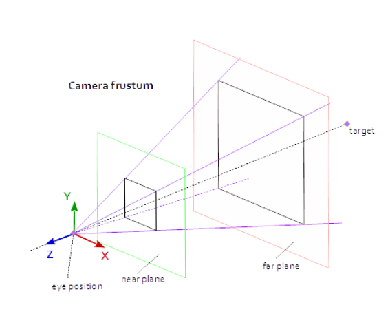
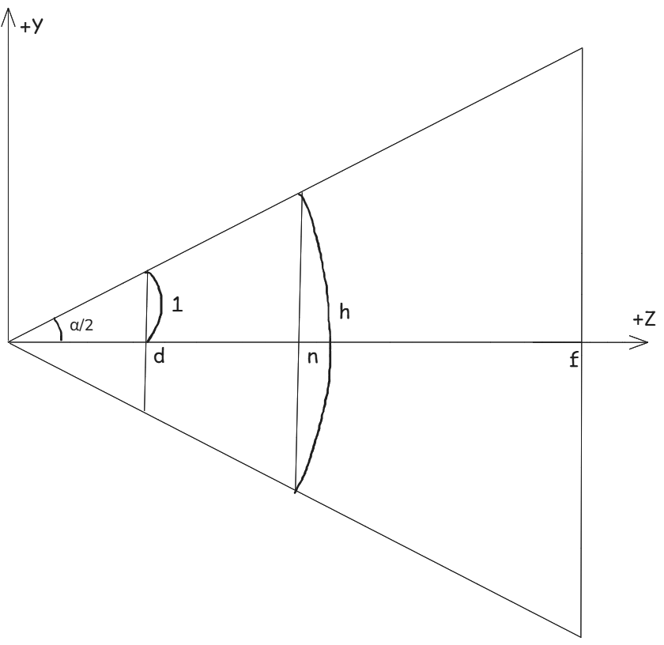

# Chapter5 Rendering Pipeline  

### View Space(시야 공간)
장면을 2차원 이미지로 형성하기 위해 카메라에 Local Space(View Space)를 부착시킴.  
이 때 World Space에서 View Space로의 변환을 View Tranform이라 하고, 이에 대응하는 행렬을 View Matrix라고 한다.  
View Space -> World Space의 좌표 변환 행렬(View Space의 좌표를 World Space로 매핑)은 다음과 같다.  
$\mathbf{W} = \begin{bmatrix} u_x & u_y & u_z & 0 \\ v_x & v_y & v_z & 0 \\ w_x & w_y & w_z & 0 \\ Q_x & Q_y & Q_z & 1 \end{bmatrix}$  
일반적으로 View Space는 위치와 방향만 다르기 때문에(Scale 변환이 없기 때문에)  
$\mathbf{W} = \mathbf{RT}$로 쓸 수 있고, 우리가 구하고자 하는 World->View 변환 행렬은 $W$(View->World 변환 행렬)의 역행렬이다.  
$\mathbf{V} = \mathbf{W}^{-1} = (\mathbf{RT})^{-1} = \mathbf{T}^{-1}\mathbf{R}^{-1} = \mathbf{T}^{-1}\mathbf{R}^T$  
$\mathbf{T}^{-1}\mathbf{R}^T$를 행렬로 표현하면  
$\mathbf{T}^{-1}\mathbf{R}^T = \begin{bmatrix} 1 & 0 & 0 & 0 \\ 0 & 1 & 0 & 0 \\ 0 & 0 & 1 & 0 \\ -Q_x & -Q_y & -Q_z & 1 \end{bmatrix} \begin{bmatrix} u_x & v_x & w_x & 0 \\ u_y & v_y & w_y & 0 \\ u_z & v_z & w_z & 0 \\ 0 & 0 & 0 & 1 \end{bmatrix} = \begin{bmatrix} u_x & v_x & w_x & 0 \\ u_y & v_y & w_y & 0 \\ u_z & v_z & w_z & 0 \\ \mathbf{-Q \cdot u} & \mathbf{-Q \cdot v} & \mathbf{-Q \cdot w} & 1 \end{bmatrix}$  
$\mathbf{V} = \begin{bmatrix} u_x & v_x & w_x & 0 \\ u_y & v_y & w_y & 0 \\ u_z & v_z & w_z & 0 \\ \mathbf{-Q \cdot u} & \mathbf{-Q \cdot v} & \mathbf{-Q \cdot w} & 1 \end{bmatrix}$  
> [!NOTE]
> Why? View->World 변환 행렬의 역행렬로 World->View 행렬을 유도하는가  
> 좌표계 $A$의 점 $\mathbf{p_A}$를 좌표계 $B$로 표현하려면 $A$의 축($u, v, w$)에 대한 $B$의 좌표($x, y, z$)가 알려져 있어야함.  
> 다시말해 $\mathbf{u_B} = (u_x, u_y, u_z), \mathbf{v_B} = (v_x, v_y, v_z), \mathbf{w_B} = (w_x, w_y, w_z)$에 대한 정보가 있어야함.  
> Wolrd Space의 축을 Local Space의 좌표로 변환이 불가능 한 것은 아님.  
> World Space의 축의 각 성분을 Local Space로 내적하면 Wolrd의 각 축에 대한 Local의 정보를 얻을 수 있음.  
> 다만 직교행렬의 역행렬은 전치행렬인 성질을 활용하여 쉽게 유도가 가능하기 때문에 이를 활용  
### Homogeneous Clip Space(동차 클립 공간)  
  
**Frustum**이란 카메라가 보는 공간의 부피를 뜻하며 다음 4가지 값으로 정의 할 수 있다.  
근거리 평면 $n$, 원거리 평면 $f$, 수직 시야각 $\alpha$, 종횡비 $r$.  
종횡비 $r = w/h$로 정의. 이 때 $w$는 투영 창의 너비, $h$는 높이이다.  
계산 상 편의를 위해 $h = 2$라고 할 때  
원점으로 부터 투영 창의 거리를 $d$라고 하면  
$\tan{\dfrac{\alpha}{2}} = \dfrac{1}{d}$  
점$(x, y, z)$에 대해서 $z = d$인 투영면 상에서의 투영점 $(x', y', d)$를 구하고자 한다.  
삼각형의 닮음 성질에 의해서 $x'$와 $y'$를 각각 다음과 같이 표현할 수 있다.  
$\dfrac{x'}{d} = \dfrac{x}{z} \Rightarrow x' = \dfrac{xd}{z} = \dfrac{x}{z\tan{(\alpha/2)}}$  
$\dfrac{y'}{d} = \dfrac{y}{z} \Rightarrow y' = \dfrac{yd}{z} = \dfrac{y}{z\tan{(\alpha/2)}}$  
점$(x, y, z)$가 frustum내에 있을 때만 다음 조건이 성립함을 관찰하라.  
$-r \leq x' \leq r$  
$-1 \leq y' \leq 1$  
$n \leq z \leq f$  
$z$는 frustum의 조건에 의해 성립함.  
투영 창의 높이를 2로 설정 했으므로  
투영 창의 세로 범위는 $[-1, 1]$이므로 $y'$도 성립함.  
투영 창의 너비는 $r = w/2 \Rightarrow w = 2r$  
투영 창의 가로 범위는 $[-r, r]$이므로 $x'$도 성립함.  
위 조건에 맞지 않는 경우 점이 frustum외부에 있음.  
### NDC(Noramlize Device Coordinate)
현재 뷰포트에 투영된 점의 좌표는 종횡비에 의존함.  
뷰포트 변환은 하드웨어(GPU)에서 실행되는 연산이기 때문에 종횡비에 대한 의존성을 제거할 필요가 있음.  
따라서 투영된 x좌표 구간을 $[-r, r]$에서 $[-1, 1]$로 스케일링 하여 의존성을 제거함.  
스케일링된 좌표를 Normal Device Coordinate(정규 장치 좌표계)라고 칭함.  
하드웨어(GPU)에서도 NDC로 제공할 것을 요구함.  
스케일링된 x, y좌표에 관한 식:  
$x' = \dfrac{x}{rz\tan{(\alpha/2)}}$  
$y' = \dfrac{y}{z\tan{(\alpha/2)}}$  

### 투영 행렬
일관성(연산 통일성)을 위해 위 식을 행렬로 표현하고자 할 때 위 식이 비선형이므로 행렬 표현이 불가능함.  
> [!NOTE]
> 비선형인 이유: $\div z$ 부분 때문에(분모에 변수가 있으면 비선형).  
> 기하학적으로 봤을 때 사다리꼴로 되어있는 frustum을 정규화된 공간(직사각형)으로 만드는 과정에서  
> 거리가 먼 경우 더 많이 압축됨. 이 때 압축되는 비율이 선형이 아니다.  

이 부분을 해결하기 위해 동차 좌표를 통해 $z$값을 $w$에 저장해두고 이후 $\div w$를 통해 이를 해결함.  
이 때 $\div w(\div z)$를 ***원근 분할(Perspective divide)*** 이라고 한다.  
$z$값을 $w$에 저장하기 위해 $[2][3]$ 요소를 $1$로 $[3][3]$ 요소를 $0$으로 설정한다.  
위 조건을 반영한 투영 행렬은 다음과 같다.  
$\mathbf{P} = \begin{bmatrix} \dfrac{1}{r\tan{(\alpha/2)}} & 0 & 0 & 0 \\ 0 & \dfrac{1}{\tan{(\alpha/2)}} & 0 & 0 \\ 0 & 0 & A & 1 \\ 0 & 0 & B & 0 \end{bmatrix}$  
이 때 $z$의 계수를 아직 모르기 때문에 $A$, $B$로 둔다.  
> [!NOTE]  
> 기존 선형 변환의 경우 4열을 $(0, 0, 0, 1)$로 두어 $w$가 벡터의 속성에 따라 0혹은 1이 될 수 있게 설정.  
> 투영 변환의 경우 원근 분할을 위해 4열을 $(0, 0, 1, 0)$로 두어 $w$에 $z$값이 될 수 있게 설정. 

임의의 점 $(x, y, z, 1)$에 이 행렬을 곱하면 다음과 같다.  
$[x,y,z,1] \begin{bmatrix} \dfrac{1}{r\tan{(\alpha/2)}} & 0 & 0 & 0 \\ 0 & \dfrac{1}{\tan{(\alpha/2)}} & 0 & 0 \\ 0 & 0 & A & 1 \\ 0 & 0 & B & 0 \end{bmatrix} = \left[ \dfrac{x}{r\tan{(\alpha/2)}}, \dfrac{y}{\tan{(\alpha/2)}}, Az+B, z \right]$  
여기서 얻어진 결과(기하학적 데이터)는 클립 공간에 있다고 한다.  
여기에 원근 분할을 시행한 결과(기하학적 데이터)는 NDC에 있다고 한다.  
식으로 표현하면 다음과 같다.  
$\left[\dfrac{x}{r\tan{(\alpha/2)}}, \dfrac{y}{\tan{(\alpha/2)}}, Az+B, z \right] \xrightarrow{divide\ by\ w} \left[ \dfrac{x}{rz\tan{(\alpha/2)}}, \dfrac{y}{z\tan{(\alpha/2)}}, A+\dfrac{B}{z}, 1 \right]$  

### 정규화된 깊이 값
NDC에서 $x$, $y$좌표를 정규화된 범위로 요구하는 것처럼, $z$좌표(카메라기준 깊이 값)도 $[0, 1]$의 정규화된 범위로 요구한다.  
따라서 구간 $[n, f]$를 $[0, 1]$로 매핑하는 순서 보존 함수(order preserving function) $g(z)$를 구성해야 한다.  
위 투영 행렬의 결과에 따르면 $g(z)$는 다음과 같다.  
$g(z) = A + \dfrac{B}{z}$  
구간 $[n, f]$를 $[0, 1]$로 매핑하려면 다음 두 조건을 만족해야 한다: 조건1:  $g(n) = A +  \dfrac{B}{n} = 0$, 조건2:  $g(f) = A +  \dfrac{B}{f} = 1$  
조건1에 의해 $B = -An$이 되고 이를 조건2에 대입하면  
$\begin{align}A + \dfrac{-An}{f} &= 1 \\  \dfrac{Af - An}{f} &= 1 \\ Af - An &= f \\ A &= \dfrac{f}{f - n} \\ B &= -\dfrac{nf}{f - n} \end{align}$  
이를 $g(z)$에 대입하면  
$g(z) = \dfrac{f}{f - n} - \dfrac{nf}{(f - n)z}$가 되고  투시 행렬은 다음과 같이 표현할 수 있다.  
$\mathbf{P} = \begin{bmatrix} \dfrac{1}{r\tan{(\alpha/2)}} & 0 & 0 & 0 \\ 0 & \dfrac{1}{\tan{(\alpha/2)}} & 0 & 0 \\ 0 & 0 & \dfrac{f}{f - n} & 1 \\ 0 & 0 & \dfrac{-nf}{f - n} & 0 \end{bmatrix}$  
## Exercises  

1. 
``` C++
   Vertex v[5] = {v0, v1, v2, v3, v4};
   
   UINT indexList[18] = {0, 1, 2,
					     0, 2, 3,
					     0, 3, 4,
					     0, 4, 1,
					     1, 4, 2,
					     2, 4, 3};
```
2. 
``` C++
	Vertex v[13] ={v0, v1, v2, v3,
			   v4, v5, v6, v7, v8, v9, v10, v11, v12};
			   
	UINT indexList[30] = {0, 1, 2,
						  0, 2, 3,
						  
						  4, 5, 6,
						  4, 6, 7,
						  4, 7, 8,
						  4, 8, 9,
						  4, 9, 10,
						  4, 10, 11,
						  4, 11, 12,
						  4, 12, 5};
   
```
3. 뷰 행렬은 다음과 같다.  
   $\mathbf{V} = \begin{bmatrix} u_x & v_x & w_x & 0 \\ u_y & v_y & w_y & 0 \\ u_z & v_z & w_z & 0 \\ \mathbf{-Q \cdot u} & \mathbf{-Q \cdot v} & \mathbf{-Q \cdot w} & 1 \end{bmatrix}$  
   $\mathbf{u}, \mathbf{v}, \mathbf{w}$는 카메라의 좌표계  
   $\mathbf{T}$는 카메라가 바라보는 목표지점, $\mathbf{Q}$는 카메라의 위치라고 할 때  
   $\mathbf{w} = \dfrac{\mathbf{T}-\mathbf{Q}}{\left\| \mathbf{T}-\mathbf{Q} \right\|}$  
   $\begin{align}\mathbf{T}-\mathbf{Q} &= (10 - (-20), 0 - 35, 30 - (-50)) \\ &= (30, -35, 80) \end{align}$  
   $\begin{align} \left\| \mathbf{T}-\mathbf{Q} \right\| &= \sqrt{30^2 + (-35)^2 + 80^2} \\&= \sqrt{8525} \\&\approx 92.33093   \end{align}$  
   $\begin{align} \mathbf{w} &= (30 / 92.33093, -35 / 92.33093, 80/92.33093) \\&\approx (0.32492, -0.37907, 0.86645) \end{align}$  
   $\mathbf{u} = \dfrac{\mathbf{j}\times \mathbf{w}}{\left\| \mathbf{j}\times \mathbf{w} \right\|}$    
   $\mathbf{j}\times \mathbf{w} = (0.86645, 0, -0.32492)$  
   $\begin{align} \left\| \mathbf{j}\times \mathbf{w} \right\| &= \sqrt{0.86645^2 + 0 + (-0.32492)^2} \\&\approx \sqrt{0.75074 + 0 + 0.10557} \\&\approx \sqrt{0.85631} \\&\approx 0.92537   \end{align}$  
   $\begin{align} \mathbf{u} &= (0.86645/0.92537, 0, -0.32492/0.92537) \\&\approx (0.93633, 0, -0.35112) \end{align}$  
   $\mathbf{v} = \mathbf{w} \times \mathbf{u}$  
   $\begin{align}  \mathbf{v} &= (((-0.37907)\cdot(-0.35112)), (0.86645\cdot0.93633 - 0.32492\cdot(-0.35112)), (-(-0.37907)\cdot0.93633) ) \\&\approx (0.13310, 0.92537, 0.35493) \end{align}$  
   $\mathbf{w} = (0.32492, -0.37907, 0.86645),\; \mathbf{u} = (0.93633, 0, -0.35112),\; \mathbf{v}=(0.13310, 0.92537, 0.35493)$  
   $\mathbf{Q\cdot w} = -63.08835$  
   $\mathbf{Q\cdot u} = -1.1706$  
   $\mathbf{Q\cdot v} = 11.97945$  
   $\mathbf{V}=\begin{bmatrix}0.93633 & 0.13309 & 0.32492 & 0\\ 0 & 0.92529 & -0.37906 & 0\\ -0.35112 & 0.35493 & 0.86646 & 0\\ 1.1706 & −11.97945 & 63.08835 & 1 \end{bmatrix}$  
4. 투시 투영 행렬은 다음과 같다:   
   $\mathbf{P} = \begin{bmatrix} \dfrac{1}{r\tan{(\alpha/2)}} & 0 & 0 & 0 \\ 0 & \dfrac{1}{\tan{(\alpha/2)}} & 0 & 0 \\ 0 & 0 & \dfrac{f}{f - n} & 1 \\ 0 & 0 & \dfrac{-nf}{f - n} & 0 \end{bmatrix}$  
   이 때 $\alpha = 45\degree$,  $r = 4/3$, $n=1$, $f=100$ 을 각각 대입하면  
   $\dfrac{1}{\tan{(\alpha/2)}} = \cot{(\alpha/2)}$ 이고,  
   $\cot{22.5\degree} = \csc{45\degree} + \cot{45\degree} = \sqrt{2} + 1$ 이므로,  
   $\dfrac{1}{r\tan{(\alpha/2)}} = \dfrac{3(\sqrt{2} + 1)}{4} = \dfrac{3\sqrt{2} + 3}{4}$  
   $\dfrac{1}{\tan{(\alpha/2)}} =\sqrt{2} + 1$  
   $\dfrac{f}{f - n} = \dfrac{100}{99}$,  $\dfrac{-nf}{f - n} = -\dfrac{100}{99}$  
   따라서 $\mathbf{P}$는 다음과 같다.  
   $\mathbf{P} = \begin{bmatrix} \dfrac{3\sqrt{2} + 3}{4} & 0 & 0 & 0 \\ 0 & \sqrt{2} + 1 & 0 & 0 \\ 0 & 0 & \dfrac{100}{99} & 1 \\ 0 & 0 & -\dfrac{100}{99} & 0 \end{bmatrix} = \begin{bmatrix} 1.81066 & 0 & 0 & 0 \\ 0 & 2.41421 & 0 & 0 \\ 0 & 0 & 1.0101 & 1 \\ 0 & 0 & -1.0101 & 0 \end{bmatrix}$  
5. $d = cot{(\alpha/2)}$ 이므로 $d = \cot{30} = \sqrt{3}$  
6. $\operatorname{arccot}{3.73205} = \arctan{0.26795} = 15\degree$이므로 $\alpha/2 = 15\degree,\, \alpha = 30\degree$  
   $\dfrac{\cot{15\degree}}{2} = 1.86603$ 이므로 $r = 2$  
   $\dfrac{f}{f - n} = 1.02564$, $\dfrac{-nf}{f - n} = -5.12821$일 때 각각 $A$, $B$ 로 두면  
   $\dfrac{B}{A} = \dfrac{-nf/(f-n)}{f/(f-n)} = -n$, $\dfrac{B}{A} = \dfrac{-5.12821}{1.02564} = -5.00000 \approx -5$ 따라서 $n = 5$  
   $\begin{align}&\dfrac{f}{f - 5} = 1.02564 \\ &f = 1.02564(f-5) \\ & f = 1.02564f - 5.1282 \\ & -0.02564f = -5.1282 \\ & f  = \dfrac{5.1282}{0.02564} \approx 200 \end{align}$  
   $\alpha = 15\degree,\,r=2,\,n=5,\,f=200$  
7. $\alpha = 2\operatorname{arccot}{B} = 2\arctan{\dfrac{1}{B}}$  
   $r = \dfrac{B}{A}$  
   $n = -\dfrac{D}{C}$  
   $f = -\dfrac{D}{C-1}$  
8. $\mathbf{q} = \mathbf{vP}$ 라고 두자.  그럼 증명할 식을 다음과 같이 표현할 수 있다.  
   $\left ( \dfrac{\mathbf{q}}{\mathbf{q}_w} \right )\mathbf{T} = \dfrac{\mathbf{qT}}{(\mathbf{qT})_w}$  
   $\mathbf{q}_w$는 스칼라이므로 다음과 같이 쓸 수 있다.  
   $\left ( \dfrac{\mathbf{q}}{\mathbf{q}_w} \right )\mathbf{T} = \dfrac{\mathbf{qT}}{\mathbf{q}_w}$  
   아핀 변환 $\mathbf{T}$의 형태는 다음과 같다.  
   $\mathbf{T} = \begin{bmatrix} u_x & u_y & u_z & 0 \\ v_x & v_y & v_z & 0 \\ w_x & w_y & w_z & 0 \\ Q_x & Q_y & Q_z & 1 \end{bmatrix}$  
   이때 4열의 형태가 (0, 0, 0, 1)이므로 $\mathbf{q}$의 $w$값은 행렬곱 이후에도 유지가 된다. 
   $(\mathbf{qT})_w = x\cdot 0 + y\cdot 0 + z\cdot 0 + w\cdot 1 = w = \mathbf{q}_w$  
   따라서 $(\mathbf{qT})_w = \mathbf{q}_w$ 이고 첫번째 식이 성립한다.  
9. 투시 투영 행렬은 다음과 같다.  
   $\mathbf{P} = \begin{bmatrix} \dfrac{1}{r\tan{(\alpha/2)}} & 0 & 0 & 0 \\ 0 & \dfrac{1}{\tan{(\alpha/2)}} & 0 & 0 \\ 0 & 0 & \dfrac{f}{f - n} & 1 \\ 0 & 0 & \dfrac{-nf}{f - n} & 0 \end{bmatrix}$  
   $\mathbf{x} = \begin{bmatrix} x_1 & x_2 & x_3 & x_4 \end{bmatrix},\, \mathbf{y} = \begin{bmatrix} y_1 & y_2 & y_3 & y_4 \end{bmatrix}$ 라고 두고  
   $\mathbf{xP} = \mathbf{y}$가 만족할 때 $\mathbf{x} = \mathbf{yP^{-1}}$을 만족하는 행렬,  
   즉 $\mathbf{x}$의 원소를 $\mathbf{y}$의 원소로 표현하는 식을 구하면 된다.  
   먼저 $\mathbf{xP}$를 구하면  
   $\mathbf{xP} = \begin{bmatrix} \dfrac{x_1}{r\tan{(\alpha/2)}} & \dfrac{x_2}{\tan{(\alpha/2)}} & \dfrac{f}{f-n}x_3 + \dfrac{-nf}{f-n}x_4 & x_3 \end{bmatrix}$이고,  
   이를 $\mathbf{y}$의 각 원소들에 대한 식으로 표현하면  
   $y_1 =\dfrac{x_1}{r\tan{(\alpha/2)}}$  
   $y_2 =\dfrac{x_2}{\tan{(\alpha/2)}}$  
   $y_3 =\dfrac{f}{f-n}x_3 + \dfrac{-nf}{f-n}x_4$  
   $y_4 =x_3$  
   이를 다시 $\mathbf{x}$의 각 원소들에 대한 식으로 변환 하면  
   $x_1 = (r\tan{(\alpha/2)}) y_1$  
   $x_2 = (\tan{(\alpha/2)}) y_2$  
   $x_3 = y_4$  
   $x_4 = -\dfrac{f-n}{nf}y_3 + \dfrac{1}{n}y_4$  
   각 원소들의 계수가 $\mathbf{P}^{-1}$의 열이 되므로    
   즉 $\mathbf{x} = \mathbf{yP^{-1}}$라고 할 때 $\mathbf{x}_i$의 $\mathbf{y}$의 원소의 계수가 $\mathbf{P}^{-1}$의 i번째 열의 성분이 되므로  
   $\mathbf{P}^{-1} = \begin{bmatrix} r\tan{(\alpha/2)} & 0 & 0 & 0 \\ 0 & \tan{(\alpha/2)} & 0 & 0 \\ 0 & 0 & 0 & -\dfrac{f-n}{nf} \\ 0 & 0 & 1 & \dfrac{1}{n} \end{bmatrix}$  
10. $\mathbf{v} = [x, y, z, 1]$, $\mathbf{v}_{ndc} = [x_{ndc}, y_{ndc}, z_{ndc}, 1]$라고 두면  
    $\mathbf{v}_{ndc} = \dfrac{\mathbf{vP}}{(\mathbf{vP})_w}$ 라고 쓸 수 있다.  
    양변에 $\mathbf{P}^{-1}$을 곱해주면  $\mathbf{v}_{ndc}\mathbf{P}^{-1} = \dfrac{\mathbf{v}}{(\mathbf{vP})_w}$ 이고 투시 투영 행렬 성질에 의해 $(\mathbf{vP})_w =z$ 이므로 다음과 같이 쓸 수 있다.  
    $[x_{ndc}, y_{ndc}, z_{ndc}, 1]\mathbf{P}^{-1} = \left [ \dfrac{x}{z}, \dfrac{y}{z}, 1, \dfrac{1}{z} \right]$ 이므로  
    이 때 $w$ 즉 $\dfrac{1}{z}$를 나누어줘야 $[x, y, z, 1]$이 된다.  
    동차 클립 공간에서는 원근 분할을 하기 이전이기 때문에 $w$로 나누는 과정은 필요 없다.  
11. 수직시야각 $\alpha$의 절반을 각으로 하고, 밑변이 $n$인 직각삼각형의 높이는 $h/2$이다.  
    따라서 $\tan{(\alpha/2)} = h/2n$ 이고 종횡비 $r = w/h$ 이므로 이를 투시 투영행렬에 대입하면  
    $\mathbf{P} = \begin{bmatrix} \dfrac{2n}{(w/h) \cdot h} & 0 & 0 & 0 \\ 0 & \dfrac{2n}{h} & 0 & 0 \\ 0 & 0 & \dfrac{f}{f - n} & 1 \\ 0 & 0 & \dfrac{-nf}{f - n} & 0 \end{bmatrix} = \begin{bmatrix} \dfrac{2n}{w} & 0 & 0 & 0 \\ 0 & \dfrac{2n}{h} & 0 & 0 \\ 0 & 0 & \dfrac{f}{f - n} & 1 \\ 0 & 0 & \dfrac{-nf}{f - n} & 0 \end{bmatrix}$  
        
12. 먼저 프러스텀의 근면 부분의 높이를 $\theta$와 $n$으로 표현하면  
    $\tan{(\theta/2)} = h/2n$   $h = 2n\cdot\tan{(\theta/2)}$  
    종횡비 $a$는 $a = w/h$ 이므로 $w = ah$  
    원점을 기준으로 동일한 거리만큼 떨어져 있으므로  
    상단 $n\cdot\tan{(\theta/2)}$ 하단 $-n\cdot\tan{(\theta/2)}$ 우측 $an\cdot\tan{(\theta/2)}$ 좌측 $-an\cdot\tan{(\theta/2)}$이고  
    이를 이용하여 좌표를 구성하면  
    $(n\cdot\tan{(\theta/2)}, an\cdot\tan{(\theta/2)})$, $(-n\cdot\tan{(\theta/2)}, an\cdot\tan{(\theta/2)})$
    $(n\cdot\tan{(\theta/2)}, -an\cdot\tan{(\theta/2)})$, $(-n\cdot\tan{(\theta/2)}, -an\cdot\tan{(\theta/2)})$  
    원면도 동일한 방식으로 적용 가능하기 때문에  
    $(f\cdot\tan{(\theta/2)}, af\cdot\tan{(\theta/2)})$, $(-f\cdot\tan{(\theta/2)}, af\cdot\tan{(\theta/2)})$
    $(f\cdot\tan{(\theta/2)}, -af\cdot\tan{(\theta/2)})$, $(-f\cdot\tan{(\theta/2)}, -af\cdot\tan{(\theta/2)})$  
13. $S_{xy}(\mathbf{u} + \mathbf{v}) = S_{xy}(\mathbf{u}) + S_{xy}(\mathbf{v})$, $S_{xy}(k\mathbf{u}) = kS_{xy}(\mathbf{u})$ 두 식 모두 성립하므로 선형변환이다.  
    선형 변환의 각 원소의 계수는 변환 행렬의 열이 되므로,  
    주어진 변환 $S_{xy}(x, y, z) = (x+zt_x, y+zt_y, z)$에 대한 행렬 표현은 다음과 같다.  
    $\begin{bmatrix} 1 & 0 & 0  \\ 0 & 1 & 0 \\ t_x & t_y & 1 \end{bmatrix}$  